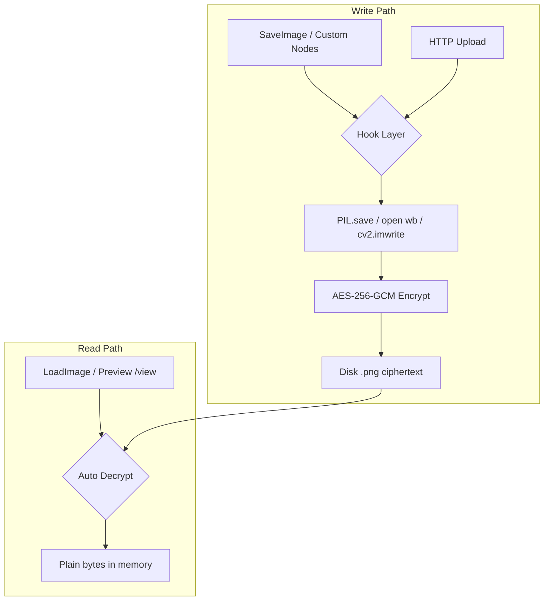

# ComfyUI Encrypt All Pictures

ComfyUI 自定义节点插件：**在进程内拦截所有图片磁盘读写**，并对 ComfyUI 管理目录（`input` / `output` / `temp` / `user`）下的图片存盘强制 AES-256-GCM 加密。

## 设计目标

- **100% 存盘加密**：通过多层 Hook，确保图片写入磁盘前必须经过加密层
- **读盘透明解密**：`Load Image`、预览、`/view` 等读取路径自动解密
- **阻止明文写入**：检测到 PNG/JPEG 等明文魔数写入受保护路径时直接拒绝

## 拦截层（由低到高）

| 层级 | 拦截点 | 作用 |
|------|--------|------|
| 1 | `builtins.open` (wb/rb) | 捕获直接 `open()` 写图片字节（含 `/upload/image`） |
| 2 | `PIL.Image.save` / `Image.open` | 覆盖 SaveImage、PreviewImage 及绝大多数节点 |
| 3 | `cv2.imwrite` / `cv2.imread` | 覆盖 OpenCV 路径 |
| 4 | `/view` 路由补丁 | HTTP 预览读取加密盘文件时解密 |
| 5 | `prestartup_script.py` | 尽可能早于其他 custom node 安装 Hook |

## 加密格式

```
CEAP\x01 | nonce (12B) | AES-GCM ciphertext + tag
```

文件扩展名保持不变（如 `.png`），磁盘内容为密文；只有持有密钥的 ComfyUI 进程能正常读取。

## 安装

1. 克隆到 ComfyUI 的 `custom_nodes` 目录（**文件夹名不要用连字符**，Python 无法 import）：

```bash
cd ComfyUI/custom_nodes
git clone <this-repo> ComfyUI_Encrypt_All_Pictures
```

2. 安装依赖：

```bash
pip install -r ComfyUI_Encrypt_All_Pictures/requirements.txt
```

3. 配置密钥（二选一）：

**方式 A：环境变量（推荐）**

```bash
# 64 位十六进制 = 32 字节 AES-256 密钥
set COMFYUI_ENCRYPT_KEY=0123456789abcdef0123456789abcdef0123456789abcdef0123456789abcdef
```

**方式 B：密钥文件**

在插件目录创建 `encrypt_key.txt`：

```
0123456789abcdef0123456789abcdef0123456789abcdef0123456789abcdef
```

或使用口令格式（第一行 salt，第二行口令）：

```
passphrase:a1b2c3d4e5f607081920a3b4c5d6e7f8
your-secret-passphrase
```

4. 重启 ComfyUI。启动日志应出现：

```
Image encryption hooks installed (PIL/cv2/open)
```

## 配置 (`config.json`)

| 字段 | 默认 | 说明 |
|------|------|------|
| `enabled` | `true` | 总开关 |
| `comfy_managed_only` | `true` | 仅加密 ComfyUI 管理目录 |
| `encrypt_all_paths` | `false` | 为 `true` 时加密进程内所有图片路径 |
| `block_plaintext_writes` | `true` | 拒绝向受保护路径写入明文图片 |

## 节点

- **Encrypt Pictures - Status**：查看密钥指纹与加密是否启用
- **Encrypt Pictures - Set Key (Hex)**：运行时设置密钥（重启后仍建议用环境变量/文件）
- **Encrypt Pictures - Export Decrypted**：将单个加密文件导出为明文（需显式指定输出路径）

## 生成密钥

```python
import secrets
print(secrets.token_hex(32))
```

## 安全说明

1. **密钥丢失 = 数据不可恢复**，请备份 `COMFYUI_ENCRYPT_KEY` 或 `encrypt_key.txt`
2. 本插件在 **同一 Python 进程内** 保证拦截；外部程序直接写盘不受控
3. 若需加密范围扩大到整个磁盘，设置 `"encrypt_all_paths": true`（仍仅限 ComfyUI 进程内的 Python 写盘）
4. 已有明文图片不会被自动加密；只有新写入会加密。可用外部脚本批量迁移

## 架构示意



## 许可证

MIT
